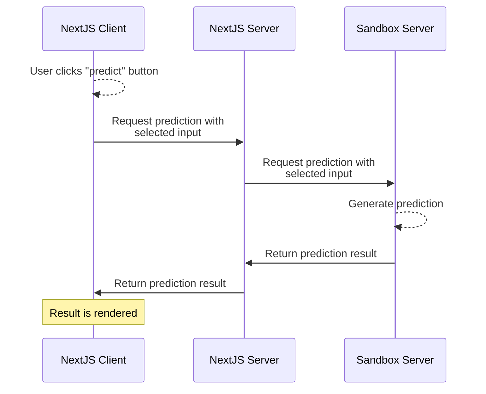

# AI4Users - Sick leave duration prediction prototype
The motivation for our project is to help customers design, prototype, and evaluate
tools that give non-experts a better understanding of AI applications. We want to
turn the design knowledge we gain into practical design principles that will make
it easier to create and use responsible AI in public services. Many of these public
services are today found online, for example, services related to taxes, unemploy-
ment, and student loans. We aim to improve AI intelligibility and accountability for an AI
model suggesting the expected total duration of sick leave. 

## Table of Contents

1. [Description](#description)
2. [Project Structure](#project-structure)
3. [Installation](#installation)
4. [Configuration](#configuration)
5. [Running the NextJS Server](#running-the-nextjs-server)
6. [Customizing the AI sandbox server](#customizing-the-ai-sandbox-server)
7. [Testing](#testing)
8. [Usage](#usage)
9. [Deployment](#deployment)
10. [Contributing](#contributing)

## Description

In this project we developed a web application that addresses the case of ensuring AI accountability and intelligibility in an online public service using an AI model to estimate the total duration of sick leave.

## Project Structure
Here are the major folders and files, and a short description of them:

```
├── __tests__:                  Jest tests
│   └── ...
├── public:                     Assets that are available publicly.
├── src
│   ├── components:             Reusable React components
│   ├── db: 
│   │   ├── models:             Database models (using mongoose) 
│   │   │   └── feedback.ts:    Describes the feedback data model
│   │   └── dbConnect.js:       Provides database connections logic and the dbConnect() function.
│   ├── pages:                  User accessible pages and API routes
│   │   ├── api:                API routes publiclyc available through HTTP calls
│   │   │   └── ...
│   │   └── ...
│   ├── styles:
│   │   └── globals.css:        Global CSS file used on every page
│   │
│   └── util:                   Utility
│       └── sendApiRequest.ts   Function for sending API requests 
├── database-dump:              Data from our MongoDB database used in testing periods.
│    └── ...
├── .gitlab-ci.yml:             Specifies the GitLab continous integration pipleline.
├── README.md:                  This file
├── jest.config.mjs:            Configuration file for the Jest testing framework.
├── next-i18next.config.js:     Configuration file for i18next.
├── next.config.js:             Configuration file for Next.js.
├── package.json:               Specifies the Nodejs package and its dependencies.
├── postcss.config.js:          Configuration file for PostCSS used in relation to Tailwind CSS.
├── tailwind.config.js:         Configuration file for Tailwind CSS.
└── tsconfig.json:              Configuration file for TypeScript
```

## Prerequisites

Before setting up this project, ensure that you have the following software, tools, or libraries installed:

- Node.js (version 12.0 or higher).
- Docker (Docker Desktop on macOS and Windows).

Optional:
- Python (version 3.7 or higher), if you wish to run the Sandbox server locally.


## Installation

1. To run locally, in the project directory run:

```bash
npm install
```
2. Then, run the development server
```bash
npm run dev
```

This runs the app in the development mode. Open [http://localhost:3000](http://localhost:3000) to view it in the browser. 


## Configuration
1. Create a `.env.local` and a `.env.test` file in the project's root directory to store environment variables:
```bash
touch .env.local
touch .env.test
```
2. In the two .env files, add the following configuration settings:
```bash
MONGODB_URI="<your mongoDB connection URI>"
SANDBOX_URI="<sandbox API URI, e.g. http://0.0.0.0>"
```
These environment variables provides the NextJS app information about how to communicate with the database and the AI sandbox server.

### Optional: configuring colors
Throughout the codebase we have strictly used predefined colors, which are defined in the tailwind config (`tailwind.config.js`). These colors can be edited if necessary to better fit the design vision. Currently we have defined color names by the colors used, but this could be changed to a priority system instead (e.g. using primary, secondary,etc.).


## Running the NextJS Server
1. Make sure the configured MongoDB is available and accessible.
2. Start the AI sandbox server [AI Sandbox Readme](sandbox-server/README.md).
3. Run the following commands to build and start the production server:
```
npm run build
npm run start
```

4. The NextJS project should now be accessible at `http://localhost:3000`. Make sure the AI server is running in order for the sandbox functionality to work.

## Customizing the AI sandbox server
Currently the AI sandbox functionality is outsourced to a standalone Python Flask server. Due to this architecture of our project, it's easy to replace or modify the calls to any external service. For instance, here is a simple sequence diagram of a call to the AI sandbox server:

In order to replace the sandbox server found in `sandbox-server/`, the code related to HTTP calls in NextJS Client (currently `src/components/Sandbox.tsx`) and in NextJS Server (currently `src/pages/api/processData.ts`).

## Testing
There is currently one unit test which tests the feedback API route. In order to test, do the following:
1. Make sure you created the `.env.test` file as described in [Configuration](#configuration).
2. Then run the tests through Jest by running:
```
npm run test
```


## Usage

The user will first be met by a usergroup login, divided between citizens and casehandlers. The casehandler login will lead to a dead page, while the citizen login will lead to the sickleave prediciton flow. This will take the user through mutliple steps where they are provided with information about their rights and how the AI system works. Here they are giving the option to consent or not to the use of the AI system. 


## Deployment

To deploy the Next.js app you can use the [Vercel Platform](https://vercel.com/new?utm_medium=default-template&filter=next.js&utm_source=create-next-app&utm_campaign=create-next-app-readme) from the creators of Next.js.

Check out [Next.js deployment documentation](https://nextjs.org/docs/deployment) for more details.


## Contributing

This project is made by a bachelor group from informatics as a part of our bachelor thesis. 


